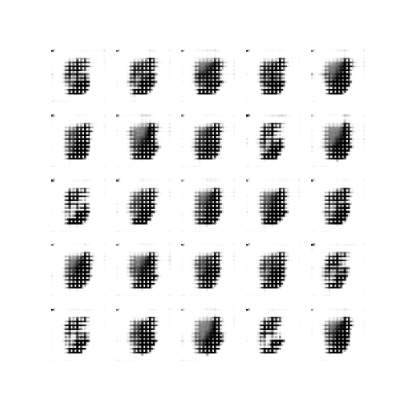
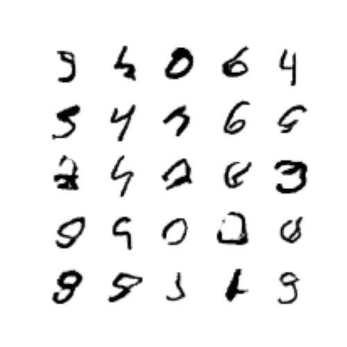
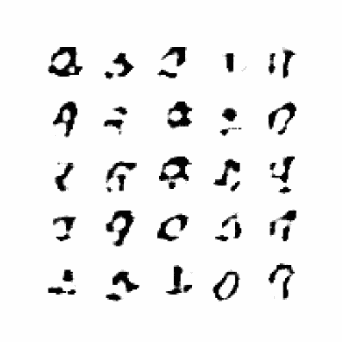

# Deep-Learning

I started this just to learn about deep learning, and to create a basic model. It's become more fleshed out as I've read tutorials and incorporated quality of life improvements for running tests and visualizing outputs. Below is a sample result

### Epochs 0 to 300, v2 of Interpolation

### Sample from the first epoch:

### And from the 1150th epoch:

## Here are some gifs, because I love visualizing deep learning
### Epochs 0 to 26, v1 of Interpolation

### Epochs 0 to 1150

